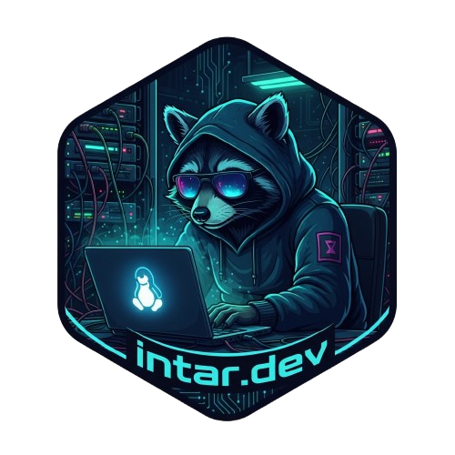

# intar

<div align="center">
  
</div>

Quickstart (rootless)
- Requirements: `qemu-system-*` in PATH (x86_64 or aarch64). No sudo, no extra networking tools.
- Also required: `qemu-img`, `ssh` (CLI), and an ISO tool (`hdiutil` on macOS, or `genisoimage`/`mkisofs`/`xorriso` on Linux).
- Install tips:
  - macOS (Homebrew): `brew install qemu`
  - Debian/Ubuntu: `sudo apt-get install qemu-system qemu-utils genisoimage` (or `xorriso`)
  - Fedora: `sudo dnf install qemu-system qemu-img genisoimage`
- aarch64 firmware: install EDK2/UEFI (e.g., `edk2-aarch64`); the path is auto-detected.
- Run (foreground): `cargo run --bin intar -- scenario run MultiDemo`
  - Runs in the foreground with `tracing` logs and a TUI.
  - Press Ctrl+C to stop and clean up all scenario data.
- SSH into a VM: `cargo run --bin intar -- scenario ssh MultiDemo web`
- Status: `cargo run --bin intar -- scenario status MultiDemo`

Networking model
- Dual NIC per VM:
  - NAT NIC: host port forwarding for SSH (`127.0.0.1:2700 + index` -> guest `22`).
  - Private LAN NIC: rootless L2 via built‑in UDP hub on localhost; all VMs join the same bus.
- Inter-VM network: `172.30.<scenario_id>.0/24`, where `<scenario_id>` is derived from scenario name.
- VM LAN IPs: `172.30.<scenario_id>.(10 + index)`; e.g. first VM gets `.10`, second `.11`, etc.
- Poor man’s DNS: `/etc/hosts` is appended with entries like `cache cache-MultiDemo cache.MultiDemo` for each VM.

Examples
- SSH from host: `ssh -i ~/.local/share/intar/scenarios/<Scenario>/ssh-keys/id_ed25519 -p 2700 intar@127.0.0.1`
- Ping between VMs (from within a VM): `ping 172.30.<sid>.11`
 - Name-based ping (from within a VM): `ping db` or `ping db.<Scenario>`

Notes
- Set `RUST_LOG=info` to increase backend logging.
- Acceleration: macOS `-accel hvf`; Linux `-enable-kvm -cpu host` (ensure permissions).
- Resources: taken from scenario (`cpus`, `memory`); defaults `1 CPU`, `512 MB`.
- aarch64 firmware is auto-detected; install EDK2 if missing.
- Base images download to the user cache on first run.

Scenario spec (HCL)
- Minimal:
  - `name = "Demo"`
  - `image = "https://.../noble-server-cloudimg-arm64.img"`
  - `vm "vm1" {}`
- Optional:
  - `sha256 = "<sha256-hex>"` verifies the downloaded image
  - VM resources: `vm "web" { cpus = 4 memory = 4096 }`

Problems (tools + optional manipulation + probes)
- Define reusable `problem "name" { ... }` blocks that can be attached to VMs via `problems = ["name", ...]`.
- A problem may include:
  - `tools { packages = [ ... ] }` — packages to install.
  - `manipulation { script = "..." }` — one shell script to run during cloud-init (optional).
  - One or more `probe "label" { metric = "..." ... }` checks to validate the system.

Example:
```
problem "tools-ready" {
  tools { packages = ["curl", "jq"] }
  manipulation {
    script = <<EOF
    echo "tools ready"
    curl --version || true
    jq --version || true
    EOF
  }
}

vm "toolbox" {
  cpus = 2
  memory = 2048
  problems = ["tools-ready"]
}
```

File-content training example
```
// A problem that starts in a failing state so learners can fix it
problem "file-fixed" {
  description = "Ensure /home/intar/intar.txt contains 'INTAR READY'"

  // Intentionally set a non-matching value during cloud-init
  manipulation {
    script = <<EOF
    # Avoid trailing newline: use printf, not echo
    printf "INTAR PENDING" > /home/intar/intar.txt
    chown intar:intar /home/intar/intar.txt
    EOF
  }

  // Probe: exported by intar-agent as a labeled metric
  probe "intar_txt_fixed" {
    metric = "intar_agent_file_content"
    labels = { path = "/home/intar/intar.txt", content = "INTAR READY" }
    op     = "eq"
    value  = 1
  }
}

vm "web" {
  problems = ["file-fixed"]
}
```
Notes
- The agent only reports file metrics for a whitelisted set of paths; `/home/intar/intar.txt` is allowed.
- Fix the problem by setting the exact content without a newline:
  - Inside the VM: `printf "INTAR READY" > /home/intar/intar.txt`

Problems UI
- Shows immediately during boot. Before probes are reachable, VMs appear with a ⏳ indicator.
- Per-problem header icon:
  - ❌ when any assigned VM hasn’t passed all its probes.
  - ✅ once all assigned VMs have passed; flips back to ❌ on any regression.
- Per-VM lines under each problem show that VM’s status (✅/❌/⏳).
- Multi-VM exercises: assign the same problem to multiple VMs; the header flips to ✅ only when all are fixed.

Paths and logs
- Cache images: `~/.cache/intar/images/`
- Scenario data: `~/.local/share/intar/scenarios/<Scenario>/`
- VM data: `.../vms/<VM>/`
  - Disk: `disk.qcow2`
  - Cloud-init: `cloud-init/`
- Runtime (sockets/PIDs/logs): platform runtime dir (Linux: `/run/user/<uid>/...`) or data dir fallback
  - QMP socket: `vm.qmp`
  - PID file: `vm.pid`
  - Log: `vm.log`
  - Scenario log: `scenario.log`

Dev workflow
- Lint/format/tests: `just check` (fmt + clippy pedantic/nursery/cargo + tests)
- Run examples:
  - `cargo run --bin intar -- scenario list`
  - `RUST_LOG=info cargo run --bin intar -- scenario run MultiDemo`
  - `cargo run --bin intar -- scenario status MultiDemo`
  - `cargo run --bin intar -- scenario ssh MultiDemo web`

Env knobs
- `INTAR_QMP_CONNECT_TIMEOUT_MS`, `INTAR_QMP_COMMAND_TIMEOUT_MS` tune QMP timeouts.
- `INTAR_AGENT_TARGET` overrides the agent target triple used when resolving a local build
  (default: `aarch64-unknown-linux-musl`).
- `INTAR_TUI_DISABLE_KEYS=1` disables TUI key handling (no raw mode); use OS signals (Ctrl+C) to stop.
- Agent discovery/config:
  - Host: `INTAR_AGENT_DISCOVERY_OTLP` changes the OTLP/HTTP endpoint returned by the
    built-in metadata server (`/agent-config`).
  - Guest: `INTAR_AGENT_OTLP_ENDPOINT` overrides the agent’s OTLP endpoint directly
    (systemd unit passes it as `--otlp-endpoint` when set).
- Probes and scraping:
  - `INTAR_PROBES_DEFAULT_INTERVAL_MS` controls the probe polling interval (default: 1000).
  - `INTAR_METRICS_SCRAPE_TIMEOUT_MS` sets the HTTP timeout for `/metrics` scrapes (default: 2000).

Clippy
- You may observe cargo “multiple crate versions” warnings due to transitive deps; acceptable for now.

- Intar Agent (in-VM metrics)
- Purpose: Collect VM metrics and push OpenTelemetry (OTLP/HTTP) to the host.
- Providing the agent binary: build `intar-agent` yourself, then either:
  - Option 1 (recommended for dev): add `local_agent = true` to the scenario to load the
    agent from `target/<target>/{release,debug}/intar-agent`.
    - Example build: `cargo build -p intar-agent --release --target aarch64-unknown-linux-musl`
  - Option 2: set `INTAR_AGENT_BUNDLE=/abs/path/to/intar-agent` to use a specific binary path.
  - If neither is provided, no agent is injected.
- How it’s injected at boot:
  - Preferred: the CLI embeds the agent into cloud-init (`gz+b64`) and writes it to
    `/usr/local/bin/intar-agent`, then enables a systemd unit.
  - Fallback: if embedding fails, it mounts a small ISO (label `INTARAGENT`) and copies the
    binary in cloud-init before enabling the unit.
- Default OTLP endpoint: `http://10.0.2.2:4318/v1/metrics` (host alias via QEMU user NAT).
  - Override via the guest env `INTAR_AGENT_OTLP_ENDPOINT`, or set the host env
    `INTAR_AGENT_DISCOVERY_OTLP` to change what the built-in metadata server returns at
    `/agent-config` (the agent reads `INTAR_METADATA_URL` for discovery).
- Metrics exposed (partial list):
  - Open ports: `intar_agent_open_port{proto,port}`, `intar_agent_open_ports_total`
  - Users/groups: `intar_agent_user_group{user,group}`, `..._users_total`, `..._groups_total`
  - Files (whitelist): `..._file_exists|mode|uid|gid{path}`
  - sshd security: presence, port, auth booleans, crypto lists, forwarding/limits, access lists

Host OTLP collector example
```
receivers:
  otlp:
    protocols:
      http:
        endpoint: 0.0.0.0:4318
exporters:
  debug:
    verbosity: detailed
processors:
  batch: {}
service:
  pipelines:
    metrics:
      receivers: [otlp]
      processors: [batch]
      exporters: [debug]
```
Run with the OpenTelemetry Collector (or your stack) on the host; the VM agent will reach it at `10.0.2.2:4318`.
